# VaidyaIQ — AI Health Assistant for Every Indian Family

<div align="center">

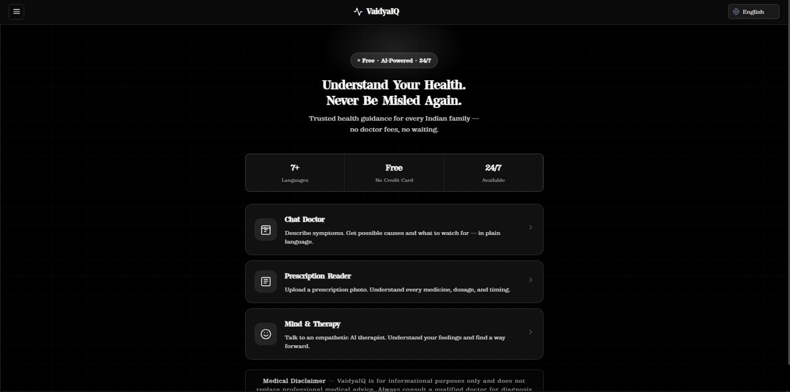

**Free · AI-Powered · 7+ Languages · 24/7 Available**

*Trusted health guidance for every Indian family — no doctor fees, no waiting.*

[](https://python.org)
[](https://flask.palletsprojects.com)
[](https://github.com/marketplace/models)

</div>

---

## Table of Contents

1. [The Problem We Solve](#the-problem-we-solve)
2. [What is VaidyaIQ?](#what-is-vaidyaiq)
3. [Features Overview](#features-overview)
4. [Feature Deep Dives](#feature-deep-dives)
   - [Chat Doctor](#1-chat-doctor)
   - [Prescription Reader](#2-prescription-reader)
   - [Mind & Therapy](#3-mind--therapy)
5. [Microsoft GitHub Models Integration](#microsoft-github-models-integration)
6. [Tech Stack](#tech-stack)
7. [Architecture](#architecture)
8. [Project Structure](#project-structure)
9. [API Reference](#api-reference)
10. [Setup & Installation](#setup--installation)
11. [Environment Variables](#environment-variables)
12. [Multi-Language Support](#multi-language-support)
13. [Accessibility & UX Design](#accessibility--ux-design)
14. [Safety & Ethics](#safety--ethics)
15. [Roadmap](#roadmap)
16. [Team](#team)

---

## The Problem We Solve

India has approximately **1 doctor per 834 people** — far below the WHO recommended ratio of 1:1000. In rural and semi-urban areas, the gap is even more severe. Millions of Indians face:

- **Long wait times** at hospitals and clinics
- **Expensive consultation fees** that are out of reach for many families
- **Language barriers** when consuming medical information (mostly available only in English)
- **Prescription confusion** — patients receive handwritten prescriptions they cannot read or understand
- **Mental health stigma** — people cannot comfortably speak to someone about emotional struggles
- **Misinformation** — families rely on unverified WhatsApp forwards for medical advice

**VaidyaIQ bridges this gap.** It is a free, AI-powered health assistant designed specifically for Indian users, accessible in 7 languages, available 24/7, with zero signup required.

---

## What is VaidyaIQ?

VaidyaIQ is a **multi-feature health intelligence platform** with three core capabilities:

| Feature | What it does |
|---|---|
| 🏥 **Chat Doctor** | Conversational symptom checker that diagnoses possible conditions using a 3-phase AI interview |
| 💊 **Prescription Reader** | Upload a photo of any prescription — get plain-language explanations of every medicine, dosage, and timing |
| 🧠 **Mind & Therapy** | An empathetic AI therapist that provides structured psychological insight in the user's chosen language |

All features run on **Microsoft's GitHub Models** (powered by Azure AI), keeping inference costs near zero while delivering frontier model quality.

---

## Features Overview

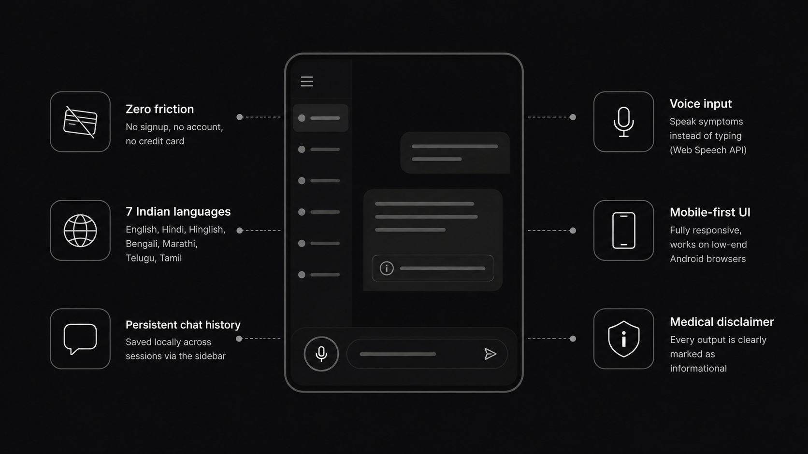

- **Zero friction** — No signup, no account, no credit card
- **7 Indian languages** — English, Hindi, Hinglish, Bengali, Marathi, Telugu, Tamil
- **Persistent chat history** — Saved locally across sessions via the sidebar
- **Voice input** — Speak symptoms instead of typing (Web Speech API)
- **Mobile-first UI** — Fully responsive, works on low-end Android browsers
- **Dark mode only** — High contrast design optimized for readability
- **Medical disclaimer** — Every output is clearly marked as informational

---

## Feature Deep Dives

---

### 1. Chat Doctor

> *The world's first 3-phase AI diagnostic conversation designed for Indian patients.*

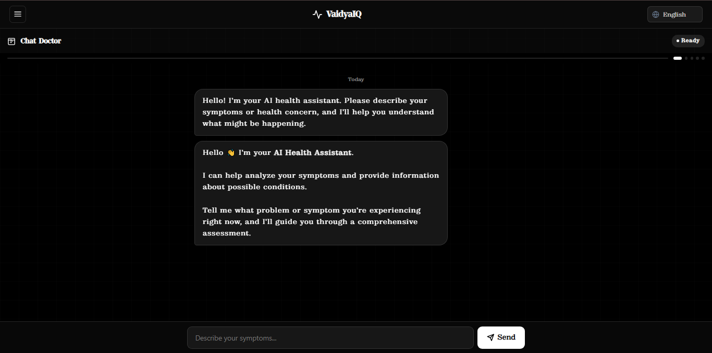
#### How It Works

The Chat Doctor is not a simple chatbot. It operates in a **structured 3-phase consultation flow** that mirrors how a real doctor thinks:

---

##### Phase 1 — Problem Description

The user types their primary complaint in free text (e.g., *"I have chest pain and shortness of breath"*).

The backend immediately calls the **GitHub Models API** to generate exactly **10 tailored yes/no/not-sure diagnostic questions** specific to that symptom cluster — not generic questions, but precise ones that a doctor would actually ask.

Example output for "chest pain":
```
1. Is the pain sharp or squeezing?
2. Does it radiate to your arm or jaw?
3. Do you feel short of breath along with the pain?
4. Does the pain worsen with physical activity?
5. Do you have a history of heart problems?
...
```

---

##### Phase 2 — Structured Q&A with Progress Tracking

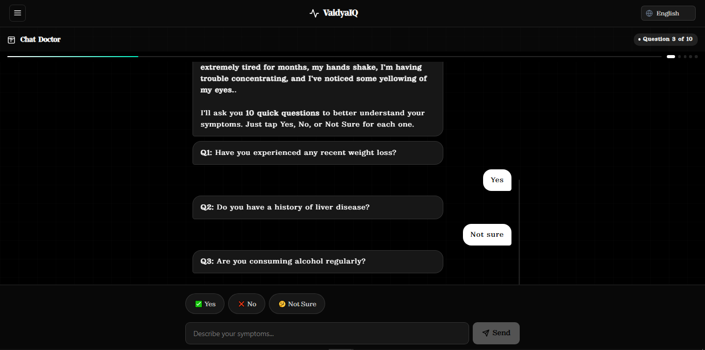
The app presents each question one-by-one in chat bubble format. Users answer via:
- **Quick-tap chips** — Yes / No / Not Sure (optimized for mobile)
- **Free text input** — for nuanced answers

A **real-time progress bar** and step dots show advancement through the 10-question interview. The input field is disabled during this phase to ensure structured data collection.

---

##### Phase 3 — Comprehensive Disease Report

After all 10 answers are collected, the AI generates a **ranked differential diagnosis** — a list of possible conditions sorted by likelihood, with evidence-based reasoning for each.

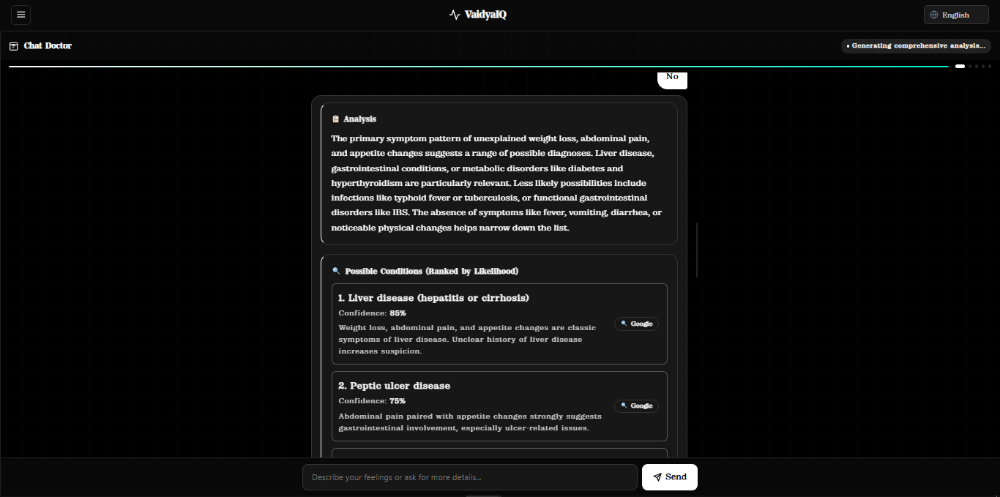

The report includes:

- **Primary symptom pattern** — what cluster was identified
- **Ranked disease list** (10–20 conditions) with:
  - Confidence percentage
  - Specific reasoning tied to the user's actual answers
  - Key matching features
- **Emergency warning** — if symptoms suggest immediate hospital visit
- **Diagnostic notes** — what to watch for
- **Google search links** — "Go →" buttons on every condition for instant research

```json
{
  "primary_symptom_pattern": "Acute chest pain with exertional component",
  "ranked_diseases": [
    {
      "name": "Angina Pectoris",
      "confidence": 87,
      "reasoning": "Squeezing chest pain worsening with activity, radiating to arm",
      "key_features": "Q3: Yes, Q4: Yes, Q7: Yes"
    },
    ...
  ],
  "emergency_warning": "Symptoms consistent with cardiac event — seek emergency care immediately",
  "disclaimer": "This is for informational purposes only. Please consult a real doctor."
}
```

---

##### Phase 4 — Elimination Round (Follow-Up)

The AI generates **3–5 targeted follow-up questions** designed specifically to distinguish between the top 5 ranked diseases. This is the differential diagnosis step — narrowing down from possible to probable.

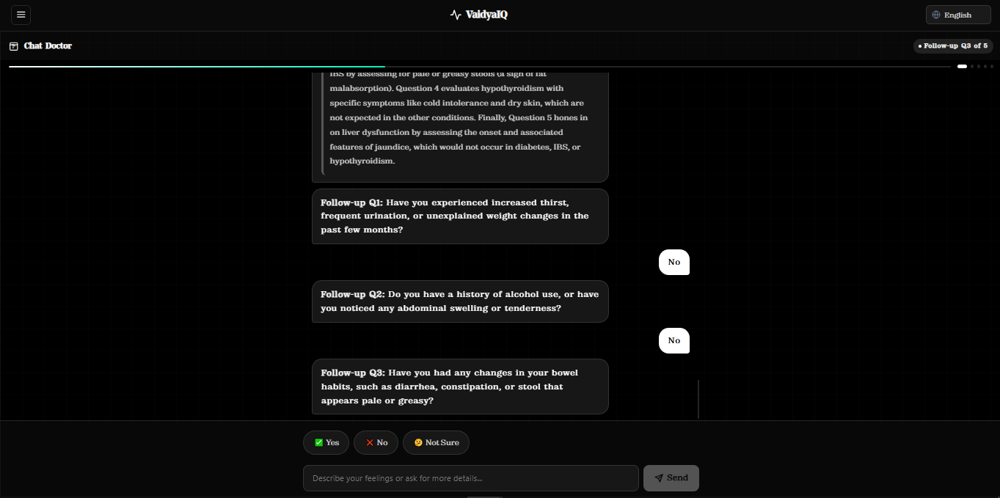

After answers, the diseases are **re-ranked** with:
- A list of eliminated conditions (with reasoning)
- Updated confidence scores
- Diseases maintained in the differential despite unchanged features
- A consistency check flag to ensure the AI didn't contradict itself

---

##### Consultation Phase

After the report, the user can continue chatting freely. The AI maintains context and answers follow-up questions. Two action buttons are always available:
- **Continue Consultation** — keep the current context
- **Start New Consultation** — fresh session

---

##### Built-in Diseases Database

VaidyaIQ ships with a local `diseases_db.py` — a structured database of 20+ common Indian diseases with:
- Symptoms mapping
- Severity ratings
- Worst-case scenarios
- Searchable by symptom keyword

This database powers the comprehensive disease analysis endpoint, ensuring zero latency for initial loading.

---

##### Diagnostic Safety Rules (Prompt Engineering)

The AI system prompt enforces strict medical reasoning rules:

```
1. Weight specific symptoms more heavily than non-specific symptoms
2. Do NOT replace evidence-based hypotheses with generic conditions without strong contradicting evidence
3. Identify the PRIMARY symptom pattern and ensure it drives the ranking
4. Use both positive findings AND negative findings
5. Maintain diagnostic consistency between symptoms and ranking
6. If uncommon but specific symptoms are reported, ensure rare disease hypotheses remain prioritized
```

This prevents the common LLM failure mode of defaulting to "anxiety" or "stress" for every complaint.

---

### 2. Prescription Reader

> *Point your camera at any prescription. Instantly understand every medicine in plain language.*

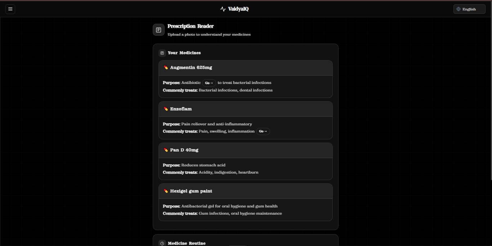

#### The Problem

Indian prescriptions are notoriously difficult to read — handwritten by doctors under time pressure, using medical abbreviations unfamiliar to patients. Patients often:
- Take the wrong dose
- Take medicine at the wrong time
- Miss critical warnings
- Don't understand what the medicine is even for

#### How It Works

1. **Upload** — Drag and drop or tap to upload any prescription photo (JPG, PNG, PDF)
2. **Optional note** — User can add context ("Doctor said this is for my sugar")
3. **AI analysis** — Image is base64-encoded and sent to GitHub Models vision API
4. **Structured output** — The AI reads the prescription and returns structured JSON

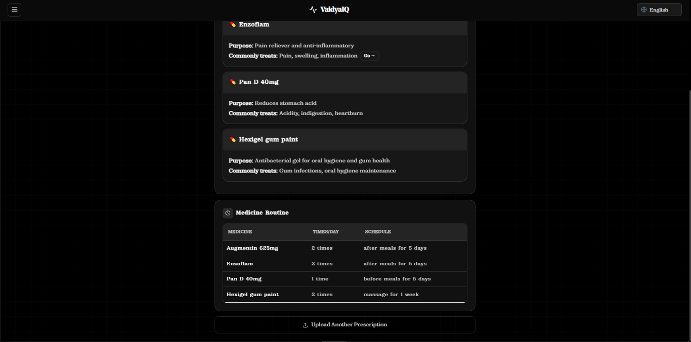

#### Output Structure

**Medicine Cards** — One card per medicine with:
- Medicine name (highlighted)
- Purpose in simple words ("reduces fever and pain")
- Commonly treated conditions ("fever, headache, body pain")
- "Go →" button linking to Google search for more info

**Routine Table** — A clear schedule showing:
| Medicine | Times Per Day | Schedule |
|---|---|---|
| Paracetamol 500mg | 3 times | Morning, Afternoon, Night after food |
| Azithromycin 250mg | 1 time | Morning before food |

**Mismatch Warning** — If the user's note contradicts what's written in the prescription, a highlighted orange warning banner appears explaining the discrepancy. The AI always trusts the prescription over the user note.

#### "Go →" Buttons

Every medical term in the output — medicine names, conditions, medical abbreviations — is automatically detected and wrapped with a "Go →" button that opens a Google search for that term. This covers 40+ common medical terms including:

```
fever, diabetes, blood pressure, paracetamol, ibuprofen, insulin,
cholesterol, Dolo, Crocin, Azithromycin, Metformin, Atorvastatin...
```

#### Vision Model Capabilities

The GitHub Models vision API can read:
- Handwritten prescriptions (even messy doctor handwriting)
- Printed/typed prescriptions
- Prescription pads with multiple medicines
- Mixed Hindi/English prescriptions
- Low-quality phone camera photos

---

### 3. Mind & Therapy

> *An empathetic AI therapist that understands Indian emotional culture — in your language.*

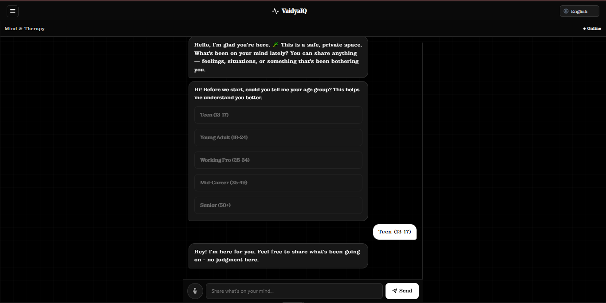
#### Why This Matters

Mental health remains deeply stigmatized in India. Therapy is expensive, inaccessible in rural areas, and culturally uncomfortable for many. People bottle up stress, relationship conflicts, workplace pressure, and grief because they have nowhere to turn.

VaidyaIQ's therapy module provides a **structured, judgment-free psychological framework** — not just a chatbot that says "I'm sorry to hear that."

#### Age-Adaptive Responses

The therapist adapts its communication style based on the user's age:

| Age Group | Communication Style |
|---|---|
| Under 18 | Simple, friendly, casual, extra gentle |
| 18–25 | Relatable, modern, acknowledges career/relationship pressures |
| 25–35 | Professional tone, acknowledges adult responsibilities |
| 35–50 | Respectful, acknowledges life complexity |
| 50+ | Warm, respectful, honors their wisdom and experience |

#### Structured 4-Part Response Framework

Every therapist response is structured as a **4-part psychological analysis** — not a generic "that sounds hard":

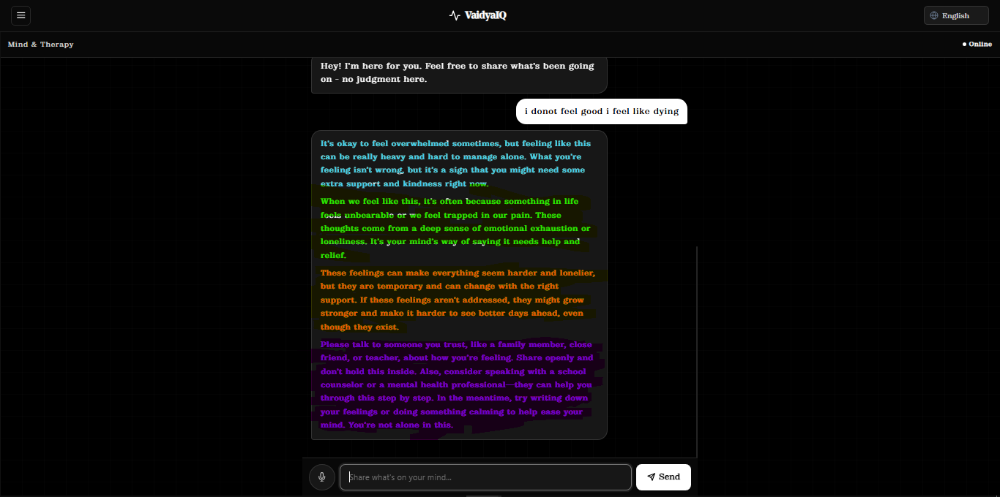
| Section | Color | What It Covers |
|---|---|---|
| 🔵 **Verdict** | Blue | Was what happened right or wrong? Honest but kind. |
| 🟢 **Psychology** | Green | Why did they feel/act this way? Human patterns and instincts. |
| 🟠 **Consequences** | Orange | Why does this need addressing? What happens if ignored? |
| 🟣 **Recommendation** | Purple | 2–3 specific, actionable, gentle next steps. |

#### Multi-Language Therapy

The therapist responds in the user's selected language — the entire psychological analysis is delivered in Hindi, Bengali, Telugu, Tamil, Marathi, Hinglish, or English. Language is enforced at the prompt level:

```python
"You MUST write the string values ENTIRELY in {language}. Do NOT mix languages."
```

#### Content Safety

- The therapist never diagnoses mental illness
- Never recommends medication
- Never provides specific helpline numbers (which can vary by region)
- Sanitizes all user input before sending to the API to avoid content filter rejections
- Has a built-in crisis fallback response for distress signals

#### Input Sanitization

A `sanitize_text()` utility replaces potentially flagged phrases before they reach the API:

```python
"kill myself" → "give up"
"suicide" → "giving up"
"end my life" → "stop trying"
"self harm" → "hurt myself"
```

This prevents `openai.BadRequestError` content policy rejections while maintaining the therapeutic context.

---

## Microsoft GitHub Models Integration

VaidyaIQ is powered entirely by **Microsoft's GitHub Models** — a Microsoft-backed AI inference service accessible via the GitHub Marketplace. This is the core of our AI integration.


### Why GitHub Models?

| Factor | Benefit for VaidyaIQ |
|---|---|
| **Microsoft Azure backbone** | Enterprise-grade reliability and uptime |
| **OpenAI-compatible API** | Drop-in replacement — we use the standard `openai` Python SDK |
| **Vision support** | Enables prescription image reading |
| **Multilingual capability** | Handles all 7 Indian languages natively |
| **Free tier for hackathons** | Zero inference cost during development |
| **GitHub ecosystem** | Tight integration with developer workflow |

### Integration Code

```python
from openai import OpenAI
import os

client = OpenAI(
    base_url="https://models.github.ai/inference",
    api_key=os.getenv("GITHUB_TOKEN")   # Your GitHub Personal Access Token
)

MODEL = os.getenv("GITHUB_MODEL")      # e.g. "gpt-4o" or "meta-llama-3.1-70b-instruct"
```

The entire backend (`prompts.py`) uses this single client for all 6 AI functions:

| Function | Endpoint Used | Description |
|---|---|---|
| `generate_questions_for_problem()` | `/chat/completions` | Generates 10 diagnostic questions |
| `analyze_symptoms()` | `/chat/completions` | Produces ranked disease report |
| `generate_followup_questions_for_elimination()` | `/chat/completions` | Creates disease-eliminating follow-ups |
| `eliminate_diseases_based_on_answers()` | `/chat/completions` | Re-ranks differential diagnosis |
| `read_prescription()` | `/chat/completions` (vision) | Reads prescription images |
| `therapist_chat()` | `/chat/completions` | Structured therapy responses |

### Vision API Usage

For prescription reading, images are base64-encoded and sent as `image_url` content blocks — the same format supported by Azure OpenAI vision models:

```python
{
    "type": "image_url",
    "image_url": {
        "url": f"data:image/jpeg;base64,{image_base64}"
    }
}
```

### Model Selection

The model is configurable via the `GITHUB_MODEL` environment variable. VaidyaIQ is tested with:
- `gpt-4o` — Best overall performance, vision support
- `gpt-4o-mini` — Faster, lower cost for question generation
- `meta-llama-3.1-70b-instruct` — Open model alternative

---

## Tech Stack

### Frontend
| Technology | Version | Purpose |
|---|---|---|
| HTML5 | — | Semantic page structure |
| CSS3 | — | Custom design system with CSS variables |
| Vanilla JavaScript | ES2022 | All interactivity, no framework dependencies |
| Web Speech API | Browser native | Voice input / text-to-speech |
| LocalStorage / SessionStorage | Browser native | Persistent chat history |

### Backend
| Technology | Version | Purpose |
|---|---|---|
| Python | 3.10+ | Core backend language |
| Flask | 3.x | REST API framework |
| Flask-CORS | — | Cross-origin request handling |
| `openai` Python SDK | Latest | GitHub Models API client |
| `python-dotenv` | — | Environment variable management |

### AI / Microsoft Integration
| Technology | Purpose |
|---|---|
| Microsoft GitHub Models | Primary AI inference (text + vision) |
| Azure AI (via GitHub Models) | Enterprise reliability backbone |
| OpenAI-compatible API | Standard interface for all AI calls |

### Design System
| Element | Specification |
|---|---|
| Primary color | `#ffffff` (white) on `#000000` (black) |
| Font (headings) | Stardom-Regular (custom OTF) |
| Font (body) | Zodiak-Regular (custom OTF) |
| Border radius | 16px (cards), 10px (inputs), 7px (small) |
| Animations | CSS cubic-bezier spring animations |
| Grid background | Subtle 40×40px dot grid via CSS pseudo-element |

---

## Architecture

```
┌─────────────────────────────────────────────────────────┐
│                     USER BROWSER                         │
│                                                          │
│  ┌──────────┐  ┌──────────────┐  ┌──────────────────┐  │
│  │  index   │  │ chat-doctor  │  │   prescription   │  │
│  │ .html    │  │    .html     │  │      .html       │  │
│  └──────────┘  └──────────────┘  └──────────────────┘  │
│       ↓               ↓                  ↓               │
│  ┌───────────────────────────────────────────────────┐  │
│  │              JavaScript Modules                    │  │
│  │  language.js │ api.js │ shared-history.js         │  │
│  │  chat-doctor.js │ prescription.js │ therapist.js  │  │
│  │  voice.js │ animations.css │ components.css       │  │
│  └───────────────────────┬───────────────────────────┘  │
└──────────────────────────┼──────────────────────────────┘
                           │ HTTP (REST)
                           ↓
┌─────────────────────────────────────────────────────────┐
│                   FLASK BACKEND (Python)                  │
│                                                          │
│  app.py  (REST API layer)                                │
│  ├── POST /api/chat-doctor                               │
│  ├── POST /api/prescription                              │
│  ├── POST /api/therapist                                 │
│  ├── POST /api/generate-questions                        │
│  ├── POST /api/generate-followup-questions               │
│  └── POST /api/eliminate-diseases                        │
│                                                          │
│  prompts.py  (AI call layer)                             │
│  ├── analyze_symptoms()                                  │
│  ├── read_prescription()                                 │
│  ├── therapist_chat()                                    │
│  ├── generate_questions_for_problem()                    │
│  ├── generate_followup_questions_for_elimination()       │
│  └── eliminate_diseases_based_on_answers()               │
│                                                          │
│  diseases_db.py  (local diseases database)               │
│  utils.py  (helpers: base64, JSON parser, sanitizer)     │
└──────────────────────────┬──────────────────────────────┘
                           │ HTTPS
                           ↓
┌─────────────────────────────────────────────────────────┐
│         MICROSOFT GITHUB MODELS (Azure AI)               │
│                                                          │
│  Endpoint: https://models.github.ai/inference            │
│  Auth: GitHub Personal Access Token                      │
│  Models: gpt-4o / gpt-4o-mini / llama-3.1-70b           │
│  Capabilities: Text generation + Vision (image reading)  │
└─────────────────────────────────────────────────────────┘
```

---

## Project Structure

```
vaidyaiq/
│
├── backend/
    ├── app.py                      # Flask app + all REST endpoints
    ├── prompts.py                  # All AI prompt functions (GitHub Models calls)
    ├── diseases_db.py              # Local diseases database
    ├── utils.py                    # Utilities: base64, JSON parser, text sanitizer
    │
├── frontend/
    ├── css/
    │   ├── main.css                # Design system, layout, responsive, sidebar
    │   ├── components.css          # Reusable UI components (bubbles, cards, chips)
    │   └── animations.css          # Spring animations, stagger effects
    │
    ├── fonts/
    │   ├── Stardom-Regular.otf     # Heading font
    │   └── Zodiak-Regular.otf      # Body font
    │
    ├── js/
    │   ├── api.js                  # HTTP calls to Flask backend
    │   ├── language.js             # Language switching + i18n 
    │   ├── shared-history.js       # Persistent chat history + 
    │   ├── chat-doctor.js          # Full 4-phase consultation logic
    │   ├── prescription.js         # File upload, drag/drop, result 
    │   ├── therapist.js            # Therapy chat + 4-part response 
    │   └── voice.js                # Web Speech API (input + TTS)
  ├── index.html                  # Landing page with feature cards
  ├── chat-doctor.html            # Chat Doctor UI
  ├── prescription.html           # Prescription Reader UI
  ├── therapist.html              # Mind & Therapy UI
  │
├── .env                        # Environment variables (not committed)
├── requirements.txt            # Python dependencies
├──.gitignore
└── README.md                   # This file
```

---

## API Reference

All endpoints accept and return JSON unless noted. Base URL: `http://127.0.0.1:5000`

---

### `GET /api/test`
Health check.

**Response:**
```json
{ "message": "VaidyaIQ backend is running!" }
```

---

### `POST /api/generate-questions`
Generate 10 diagnostic yes/no questions from a symptom description.

**Request:**
```json
{ "problem": "I have chest pain and shortness of breath" }
```

**Response:**
```json
{
  "questions": [
    "Is the pain sharp or squeezing in nature?",
    "Does the pain radiate to your arm or jaw?",
    "..."
  ]
}
```

---

### `POST /api/chat-doctor`
Generate a ranked disease analysis from 10 Q&A pairs.

**Request:**
```json
{
  "questions": ["Is the pain constant?", "Do you have fever?", "..."],
  "answers":   ["Yes", "No", "Not sure", "..."]
}
```

**Response:**
```json
{
  "primary_symptom_pattern": "Acute localized chest pain",
  "ranked_diseases": [
    {
      "name": "Angina Pectoris",
      "confidence": 87,
      "reasoning": "Squeezing pain worsening with exertion",
      "key_features": "Q1: Yes, Q4: Yes"
    }
  ],
  "analysis": "Overall diagnostic reasoning...",
  "emergency_warning": "Seek emergency care if pain persists",
  "diagnostic_notes": "Rule out cardiac causes first",
  "disclaimer": "For informational purposes only."
}
```

---

### `POST /api/generate-followup-questions`
Generate elimination-round follow-up questions targeting top 5 diseases.

**Request:**
```json
{
  "ranked_diseases": [{ "name": "Angina", "confidence": 87 }, "..."],
  "symptom_history": "Chest pain with exertional component"
}
```

**Response:**
```json
{
  "questions": ["Does the pain go away with rest?", "..."],
  "rationale": "These questions distinguish angina from GERD and anxiety",
  "diagnostic_focus": "Cardiac vs gastrointestinal etiology"
}
```

---

### `POST /api/eliminate-diseases`
Re-rank diseases based on follow-up answers.

**Request:**
```json
{
  "ranked_diseases": [...],
  "elimination_questions": ["Does pain go away with rest?"],
  "new_answers": ["Yes"]
}
```

**Response:**
```json
{
  "initial_top_disease": "Angina Pectoris",
  "re_ranked_diseases": [...],
  "eliminated_diseases": ["GERD", "Anxiety"],
  "next_steps": "ECG and stress test recommended",
  "consistency_check_passed": true,
  "confidence_level": "high"
}
```

---

### `POST /api/prescription`
Upload and analyze a prescription image.

**Request:** `multipart/form-data`
- `image` — Image file (JPG/PNG)
- `note` — Optional user note (string)

**Response:**
```json
{
  "medicines": [
    {
      "name": "Paracetamol 500mg",
      "purpose": "Reduces fever and relieves pain",
      "common_conditions": "Fever, headache, body pain"
    }
  ],
  "routine": [
    {
      "medicine": "Paracetamol 500mg",
      "times_per_day": "3 times",
      "schedule": "Morning, afternoon, night after food"
    }
  ],
  "mismatch_warning": null
}
```

---

### `POST /api/therapist`
Get a structured 4-part therapy response.

**Request:**
```json
{
  "messages": [
    { "role": "user", "content": "I had a fight with my parents and I feel terrible" }
  ],
  "language": "hindi",
  "age": 22
}
```

**Response:**
```json
{
  "reply": {
    "verdict": "...",
    "psychology": "...",
    "consequences": "...",
    "recommendation": "..."
  },
  "structured": true
}
```

---

## Setup & Installation

### Prerequisites
- Python 3.10+
- A GitHub account with access to [GitHub Models](https://github.com/marketplace/models)
- A GitHub Personal Access Token with model access

### 1. Clone the Repository
```bash
git clone https://github.com/yourusername/vaidyaiq.git
cd vaidyaiq
```

### 2. Install Python Dependencies
```bash
pip install -r requirements.txt
```

**`requirements.txt`:**
```
flask
flask-cors
openai
python-dotenv
```

### 3. Set Up Environment Variables
```bash
cp .env.example .env
```

Edit `.env`:
```env
GITHUB_TOKEN=your_github_personal_access_token_here
GITHUB_MODEL=gpt-4o
```

> **Getting your GitHub Token:** Go to [GitHub Settings → Developer Settings → Personal Access Tokens](https://github.com/settings/tokens) → Generate new token → Select `models:read` scope.

### 4. Start the Backend
```bash
python app.py
```

Backend runs at `http://127.0.0.1:5000`

### 5. Open the Frontend
Simply open `index.html` in your browser, or serve it with any static file server:

```bash
# Python simple server
python -m http.server 8080

# Then open: http://localhost:8080
```

> **Note:** The frontend's `api.js` points to `http://127.0.0.1:5000` by default. Change `BASE_URL` in `api.js` if deploying to a different environment.

---

## Environment Variables

| Variable | Required | Description | Example |
|---|---|---|---|
| `GITHUB_TOKEN` | ✅ | GitHub Personal Access Token for GitHub Models API | `ghp_xxxxxxxxxxxx` |
| `GITHUB_MODEL` | ✅ | Model identifier from GitHub Models marketplace | `gpt-4o` |

---

## Multi-Language Support

VaidyaIQ supports **7 Indian languages** with a unified language switching system.


### Supported Languages

| Language | Script | Speech Code | UI Label |
|---|---|---|---|
| English | Latin | `en-IN` | English |
| Hindi | Devanagari | `hi-IN` | हिन्दी |
| Hinglish | Latin (Hindi words) | `hi-IN` | Hinglish |
| Bengali | Bengali | `bn-IN` | বাংলা |
| Marathi | Devanagari | `mr-IN` | मराठी |
| Telugu | Telugu | `te-IN` | తెలుగు |
| Tamil | Tamil | `ta-IN` | தமிழ் |

### How Language Switching Works

1. User selects language from the navbar dropdown
2. `setLanguage()` fires a `languageChanged` custom event
3. All `data-i18n` elements are updated with translated strings
4. All `data-i18n-placeholder` attributes are updated
5. Voice input uses the correct `speechCode` for recognition
6. Text-to-speech uses the correct voice for the language
7. The Therapy API call passes the language, and the AI responds in that language

### Voice Integration

The `voice.js` module provides:
- **Speech-to-text** via Web Speech API — speak symptoms instead of typing
- **Text-to-speech** — AI responses can be read aloud
- **Gender-selectable voice** — female (default) or male
- **Language-aware voice selection** — matches the currently selected UI language
- **Chrome-optimized** with graceful fallback messaging for unsupported browsers

---

## Accessibility & UX Design

### Chat History & Sidebar

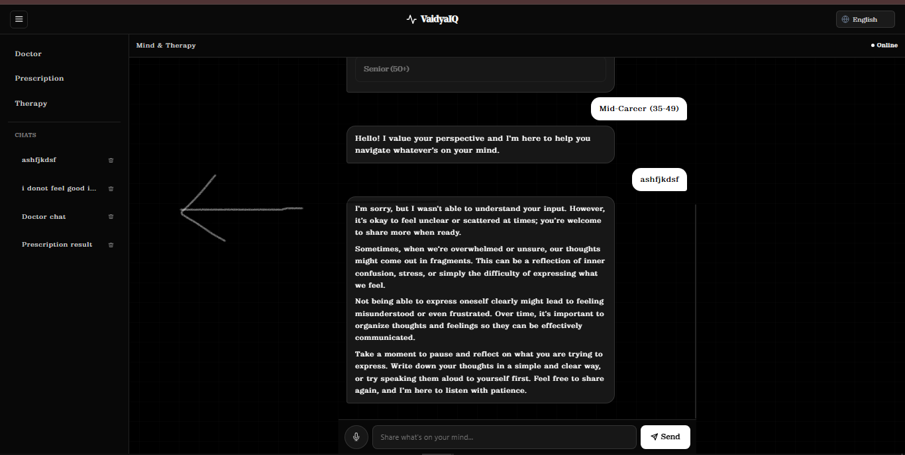

- All chat sessions are **automatically saved** to `localStorage` as the conversation progresses
- A **hamburger sidebar** lists all past sessions (Doctor, Prescription, Therapy separately)
- Sessions are titled from the first user message
- Any session can be **restored** with one click — the full HTML of the chat is preserved
- Sessions can be **deleted** individually
- On mobile, the sidebar slides over full-screen with scroll lock and overlay close

### Mobile-First Design

- All tap targets are minimum 44×44px
- Answer chips are large, clearly labeled, and spaced for thumb use
- Input field stays pinned to the bottom (`position: sticky`)
- Chat window uses `-webkit-overflow-scrolling: touch` for momentum scrolling
- Custom scrollbar styling on desktop, hidden on mobile

### Animation System

```css
/* Spring animations for natural feel */
.slide-up { animation: slideUp 0.3s cubic-bezier(0.34, 1.56, 0.64, 1); }
.fade-in  { animation: fadeIn 0.35s cubic-bezier(0.4, 0, 0.2, 1); }

/* Staggered children */
.stagger > *:nth-child(1) { animation-delay: 0.05s; }
.stagger > *:nth-child(2) { animation-delay: 0.10s; }
```

Chat bubbles use `msgIn` animation for a natural messaging feel. All animations respect `prefers-reduced-motion`.

### ARIA & Semantic HTML

- Chat window has `role="log"` and `aria-live="polite"`
- Progress bar uses `role="progressbar"` with `aria-valuenow`
- Answer chips group uses `role="group"` with `aria-label`
- Language selector has `aria-label`
- All icon-only buttons have `aria-label`
- Navigation uses semantic `<nav>`, `<aside>`, `<main>`

---

## Safety & Ethics

VaidyaIQ is built with safety as a primary design constraint, not an afterthought.

### Medical Safety
- **Every response** includes a medical disclaimer
- The AI is instructed to **never say the person is definitely dying**
- Emergency warnings are surfaced prominently when symptoms are serious
- The landing page displays a clear disclaimer banner
- The system positions itself as **informational only**, never diagnostic

### Mental Health Safety
- Therapist **never diagnoses** mental illness
- Therapist **never recommends medication**
- Input is sanitized to avoid triggering content filters on sensitive topics
- Crisis response is built in — if distress signals are detected, the AI calmly encourages contacting trusted people or emergency services
- No specific helpline numbers are given (to avoid regional inaccuracy)

### Privacy
- **No user data is sent to any server except the AI inference call**
- Chat history is stored entirely in the user's own `localStorage`
- No accounts, no tracking, no analytics
- No backend database — the Flask server is stateless

### Misinformation Prevention
- The AI is prompted to use **evidence-based diagnostic reasoning**
- Specific rules prevent the common LLM failure of defaulting to generic diagnoses
- "Go →" buttons always link to authoritative sources (Google Search) for verification
- Prescription reader trusts the prescription over user notes to prevent self-misdiagnosis

---

## My Thought of expanding

### Phase 2 
- [ ] **Ayurvedic overlay** — Map symptoms to Ayurvedic remedies alongside allopathic
- [ ] **Lab report reader** — Upload blood test PDFs and get plain-language explanations
- [ ] **Medicine reminder** — Set notification reminders from prescription schedule
- [ ] **Teleconsultation booking** — Connect users to verified doctors for follow-up
- [ ] **Offline mode** — Core symptom checker works without internet (on-device model)

### Phase 3
- [ ] **WhatsApp integration** — Access VaidyaIQ directly via WhatsApp for feature phone users
- [ ] **Voice-first mode** — Complete voice-in, voice-out consultation (no typing required)
- [ ] **Family profiles** — Manage health records for multiple family members
- [ ] **Insurance guidance** — Help users understand what their insurance covers

---

## Team

Built with ❤️ for India at  Agents League Hackathon 2026

| Name | Role | GitHub |
|---|---|---|
| Gaurav Biswas | Full Stack + AI + Design + Frontend | [@dym-gaurav](https://github.com/dym-gaurav) |


---

<div align="center">

**VaidyaIQ** — Because every Indian family deserves trusted health guidance.

*Powered by [Microsoft GitHub Models](https://github.com/marketplace/models)*


</div>
